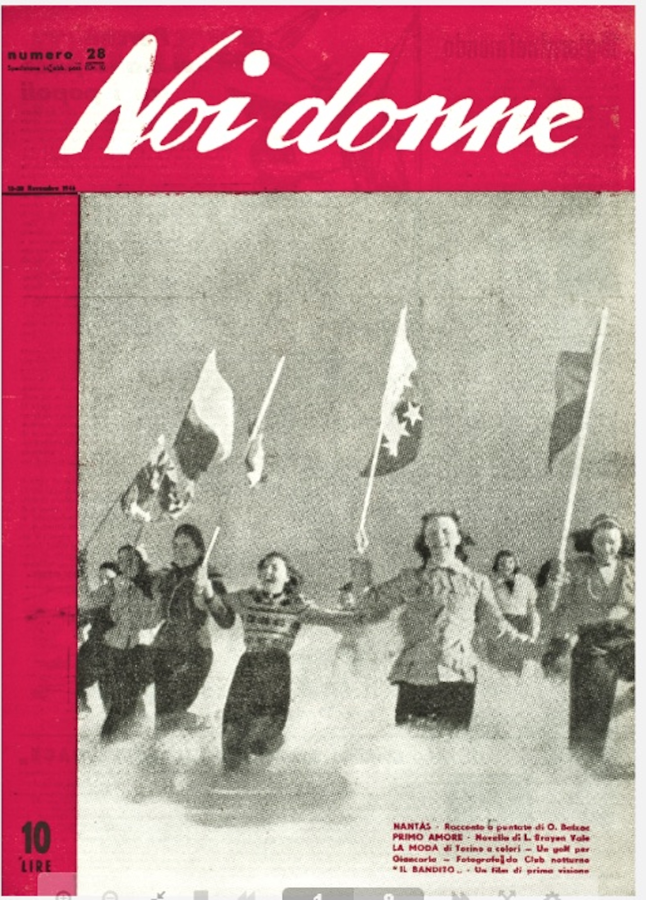
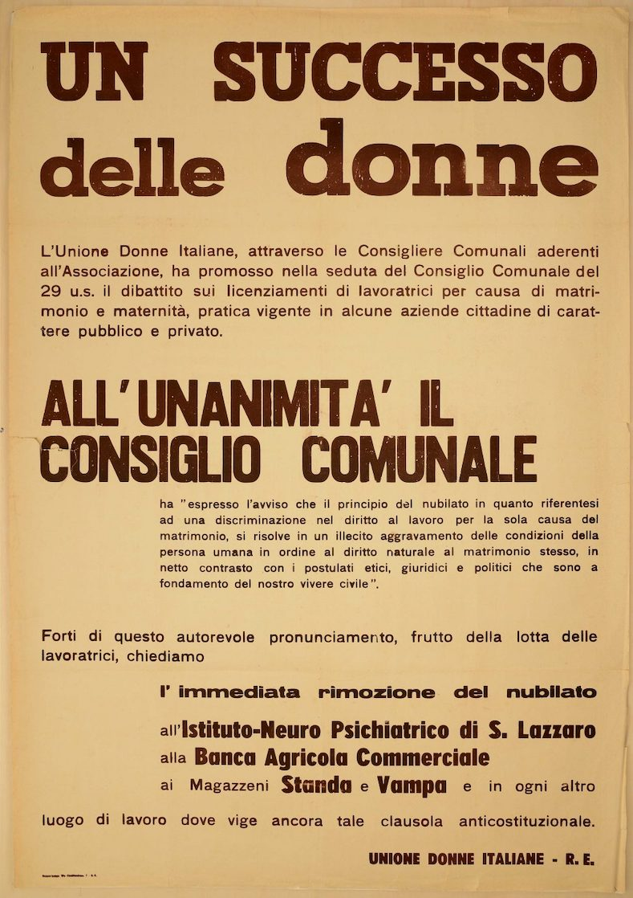
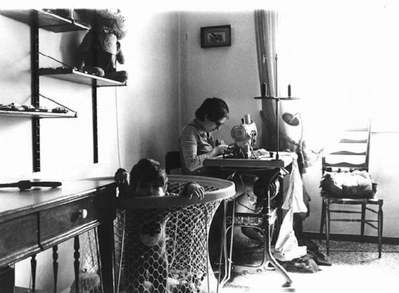
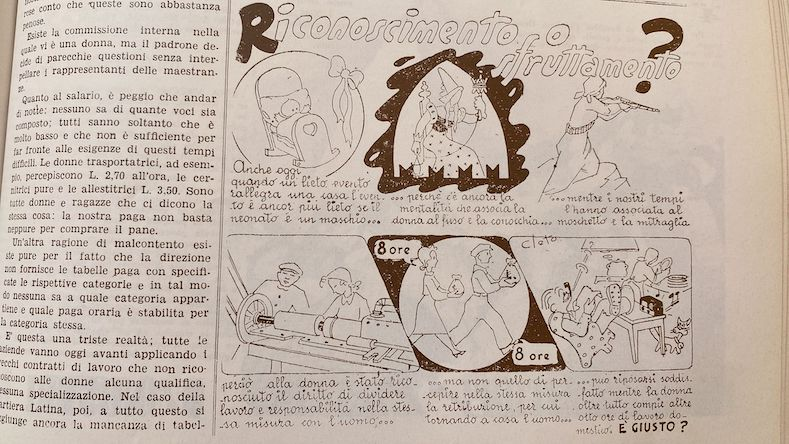

## Il decreto luogotenenziale del 1° febbraio 1945

Il decreto luogotenenziale del 1° febbraio 1945 conferisce il diritto di voto alle donne che abbiano compiuto 21 anni. Le uniche donne ad essere ancora escluse dal diritto di voto sono le prostitute schedate che esercitino il proprio mestiere al di fuori delle cc.dd. “case di tolleranza”.

Il decreto, emanato dal Presidente del Consiglio dei ministri del Regno d’Italia Ivanoe Bonomi (in carica dal 1944 al 1945) non prevede però l’eleggibilità delle donne.

Solo l’anno successivo, tuttavia, con il decreto luogotenenziale n. 47 del 10 marzo 1946, viene concesso alle donne, che abbiano compiuto il venticinquesimo anno d’età, di essere elette.

---

## La legge del 26 agosto 1950

La legge approvata il 26 agosto del 1950 per la tutela fisica ed economica delle lavoratrici madri è proposta e fortemente voluta da Teresa Noce (PCI) e sostenuta da Maria Federici (DC).

La legge stabilisce l’impossibilità di licenziare le lavoratrici durante il periodo di gestazione fino al compimento di un anno di età dell’infante; vieta, inoltre, di svolgere lavori pericolosi, faticosi o insalubri alle lavoratrici gestanti.

La norma stabilisce due periodi di riposo durante la giornata lavorativa per l’allattamento, ai datori di lavoro è richiesto istituire una camera di allattamento quando nell’azienda siano occupate almeno trenta donne coniugate di età non superiore ai 50 anni.

Si stabilisce un’indennità giornaliera per l’assenza obbligatoria, dalla data presunta del parto a otto settimane post-partum, pari all’80% della retribuzione, con l’eccezione di lavoranti a domicilio e lavoratrici rurali alle quali viene applicato un assegno una tantum.

---

## La ratifica della convenzione OIL n.100 nel 1956

A seguito della ratifica della convenzione OIL n. 100 nel 1956, con il trattato di Roma viene sancita la c.d. parità salariale e di trattamento tra lavoratori uomini e lavoratrici donne.

All’art. 119 si afferma che: “Ciascuno Stato membro assicura durante la prima tappa, e in seguito mantiene, l’applicazione del principio della parità delle retribuzioni fra i lavoratori di sesso maschile e quelli di sesso femminile per uno stesso lavoro”.

In egual modo si afferma il significato/definizione di parità di retribuzione ex. articolo 141 che stabilisce: “A. Che la retribuzione corrisposta per uno stesso lavoro pagato a cottimo sia fissata in base a una stessa unità di misura. B. che la retribuzione corrisposta per un lavoro pagato a tempo sia uguale per uno stesso posto di lavoro”.

---

## La legge n.339 del 2 aprile 1958

Il lavoro domestico viene disciplinato con la legge del 2 aprile 1958 n. 339.

All’articolo 1 della suddetta legge, si afferma che: "Sono addetti ai servizi domestici coloro che prestano la loro opera, continuativa e prevalente, di almeno 4 ore giornaliere presso lo stesso datore di lavoro, con retribuzione in denaro o in natura.

S’intendono per addetti ai servizi personali domestici i lavoratori di ambo i sessi che prestano a qualsiasi titolo la loro opera per il funzionamento della vita familiare sia che si tratti di personale con qualifica specifica, sia che si tratti di personale adibito a mansioni generiche".

---

## L’accordo interconfederale nell’industria del 16 luglio 1960

Il 16 luglio 1960 viene stipulato a Milano l’accordo interconfederale nell’industria per la parità di retribuzione tra lavoratori e lavoratrici tra le sigle sindacali Cgil, Cisl e Uil e Confindustria in rappresentanza delle aziende private e Intersind in rappresentanza delle aziende pubbliche.

L’accordo elimina la divisione tra categorie maschili e femminili, introducendo uno schema unico di qualifiche che dovrebbe rispecchiare le competenze dei lavoratori.

Nonostante l’importante cambiamento, spesso le donne erano inquadrate nelle qualifiche più basse.

---

## La legge n.7 del 9 gennaio 1963

La legge n. 7 del 9 gennaio 1963 sancisce il divieto di licenziamento nei confronti delle lavoratrici che abbiano convolato a nozze.

Questa disposizione fu necessaria per evitare, come ampiamente avvenuto, che i datori sfuggissero agli obblighi imposti dalla legge n. 860 del 1950, mettendo in pratica discriminazione delle lavoratrici in quanto potenziali madri.

La legge del 1963 stabilisce dunque che siano da considerare nulle le clausole di nubilato e le cosiddette dimissioni in bianco, presentate nel periodo compreso tra il giorno delle pubblicazioni matrimoniali ad un anno dopo la celebrazione del matrimonio.

---

## La legge del 9 febbraio 1963

La legge del 9 febbraio 1963 sancisce l’ammissione della donna ai pubblici uffici e alle professioni.

Il primo articolo recita: "la donna può accedere a tutte le cariche, professioni ed impieghi pubblici, compresa la Magistratura, nei vari ruoli, carriere e categorie, senza limitazione di mansioni e di svolgimento della carriera, salvi i requisiti stabiliti dalla legge".

Rimane escluso l’arruolamento nelle Forze Armate e nei corpi speciali, regolato da leggi particolari.

---

## La legge del 15 settembre 1964

La legge del 15 settembre 1964 stabilisce l’eguaglianza tra uomo e donna nel lavoro agricolo, l’art. 7 precisava “ai fini della presente legge, il lavoro della donna è considerato equivalente a quello dell'uomo”.

Era così abolito il “coefficiente Serpieri”, regolamento del periodo fascista in base al quale il lavoro svolto da una donna in agricoltura veniva considerato pari al 60% di quello svolto da un uomo. 

---

## La legge del 30 dicembre 1971

La legge emanata il 30 dicembre 1971 definisce la tutela fisica ed economica delle lavoratrici madri, introducendo notevoli miglioramenti rispetto alla legge 860/1950.

La norma allarga la tutela per le lavoratrici alle apprendiste, alle socie delle attività cooperative, alle lavoratrici a domicilio e a quelle addette ai servizi domestici e familiari.

Stabilisce, inoltre, il riconoscimento di un assegno di maternità alle coltivatrici dirette, alle artigiane e alle esercenti di un’attività commerciale.

Il periodo di assenza obbligatoria dal lavoro per le gestanti è di due mesi prima e tre dopo il parto con la retribuzione, per tutte le lavoratrici dipendenti, all’80%; il periodo facoltativo invece dura sei mesi entro il primo anno del bambino con la retribuzione al 30%.

---

## Il piano statale del 6 dicembre 1971

Il 6 dicembre 1971 viene approvato un piano statale che prevede l’istituzione di asili nido, considerati come un servizio sociale di interesse pubblico e parte integrante delle politiche per la famiglia.

L’articolo 1 precisa che “gli asili-nido hanno lo scopo di provvedere alla temporanea custodia dei bambini, per assicurare una adeguata assistenza alla famiglia e anche per facilitare l'accesso della donna al lavoro nel quadro di un completo sistema di sicurezza sociale”.

La legge assegna un ruolo di primo piano agli enti locali, concedendo alle regioni fondi speciali per l’erogazione di contributi in denaro ai comuni per “la costruzione, l'impianto e l'arredamento dell'asilo-nido “ oppure per “le spese di gestione, funzionamento e manutenzione dell'asilo-nido”.

---

## La legge del 18 dicembre 1973

La legge datata 18 dicembre 1973, modificando la precedente legge n. 264 del 13 marzo 1958, regolamenta e tutela il lavoro a domicilio, così definito:

“È lavoratore a domicilio chiunque, con vincolo di subordinazione, esegue nel proprio domicilio o in locale di cui abbia disponibilità ..., lavoro retribuito per conto di uno o più imprenditori, utilizzando materie prime o accessorie e attrezzature proprie o dello stesso imprenditore, anche se fornite per il tramite di terzi”.

Viene istituita una commissione di controllo per il lavoro a domicilio, a più livelli territoriali, per monitorare l’applicazione della legge.

La retribuzione avviene a cottimo in conformità a quanto stabilito dai contratti collettivi di categoria.

In mancanza di tale riferimento, il totale dell’importo viene pattuito da un’apposita commissione.

Viene garantito l’accesso per i lavoratori a domicilio ad assicurazioni sociali e assegni familiari.

Viene istituito un registro dei committenti (datori di lavoro) e dei lavoratori a domicilio.

---

## La legge del 9 dicembre 1977

La legge approvata il 9 dicembre 1977 sancisce la parità di trattamento, in materia di lavoro, tra uomini e donne.

La legge è stata approvata sulla base di un disegno di legge proposto dal Ministro del lavoro Tina Anselmi.

L’art. 1 stabilisce che: “è vietata qualsiasi discriminazione fondata sul sesso per quanto riguarda l’accesso al lavoro, indipendentemente dalle modalità di assunzione e qualunque sia il settore o il ramo di attività, a tutti i livelli della gerarchia professionale”.

La norma stabilisce inoltre che, a parità di prestazioni, la lavoratrice ha diritto alla stessa retribuzione del lavoratore.
